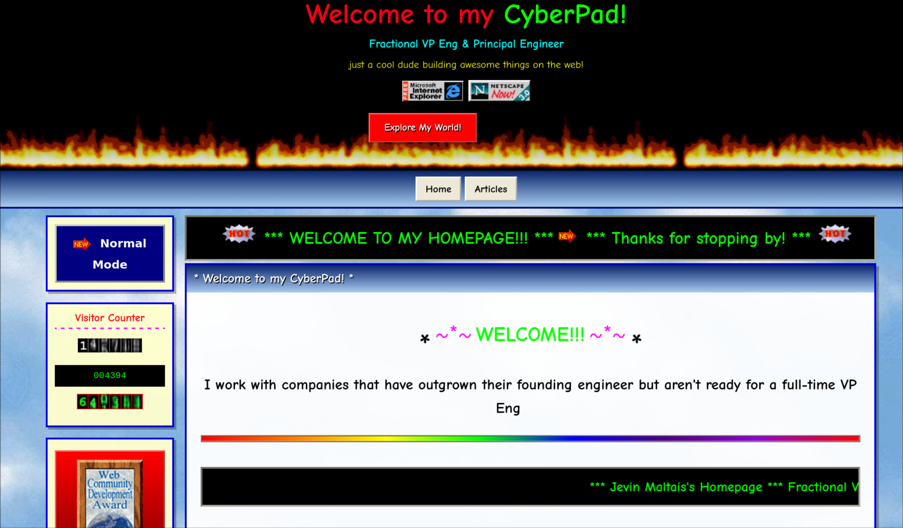

# Geocities Hugo Theme

A nostalgic 90s GeoCities-inspired Hugo theme complete with starry backgrounds, rainbow text, marquees, animated GIFs, visitor counters, and everything that made the early web great.



**[Live Demo](https://www.jevy.org/retro)**

## Quick Start

```bash
# Create a new Hugo site
hugo new site my-rad-site
cd my-rad-site

# Add the theme
git submodule add https://github.com/jevy/hugo-theme-geocities themes/geocities

# Copy the example config
cp themes/geocities/exampleSite/config.toml .

# Create your first article
hugo new articles/hello-world/index.md

# Start the dev server
hugo server -D
```

## Configuration Reference

### Header

| Parameter | Default | Description |
|---|---|---|
| `params.header.title` | `"CyberPad!"` | Rainbow text in the banner |
| `params.header.subtitle` | `"Welcome to my corner of the web!"` | Subtitle below the title |
| `params.header.tagline` | `"building awesome things on the web!"` | Small tagline text |
| `params.header.homepageTitle` | `"Welcome to my Homepage!"` | Homepage `<title>` suffix and welcome panel heading |

### Theme Toggle (optional)

| Parameter | Default | Description |
|---|---|---|
| `params.themeToggle.url` | — | URL the toggle button links to |
| `params.themeToggle.label` | `"Normal Mode"` | Button label text |

If `params.themeToggle` is not set, no toggle buttons appear.

### Banner

| Parameter | Default | Description |
|---|---|---|
| `params.banner.subtitle` | `"Welcome to my corner of the web!"` | Welcome panel subtitle |

### Tiles / Projects

| Parameter | Default | Description |
|---|---|---|
| `params.tiles.enable` | `false` | Show project showcase on homepage |
| `params.tiles.showcase[].title` | — | Project title |
| `params.tiles.showcase[].subtitle` | — | Project description |
| `params.tiles.showcase[].url` | — | Project link |

### Contact

| Parameter | Default | Description |
|---|---|---|
| `params.contact.enable` | `false` | Show contact section on homepage |
| `params.contact.email[].title` | — | Label for email |
| `params.contact.email[].email` | — | Email address (first entry used in sidebar & footer) |

### Sidebar

| Parameter | Default | Description |
|---|---|---|
| `params.sidebar.links[].name` | — | Link text |
| `params.sidebar.links[].url` | — | Link URL |
| `params.sidebar.links[].external` | `false` | Open in new tab |
| `params.sidebar.social[].url` | — | Social link URL |
| `params.sidebar.social[].label` | — | Social link label |

### Menus

The theme uses `menu.main` for footer navigation links.

```toml
[[menu.main]]
  name = "Home"
  url = "/"
  weight = 1

[[menu.main]]
  name = "Articles"
  url = "/articles"
  weight = 2
```

## Content Sections

The theme supports these content sections:

- **`content/articles/`** — Blog posts, displayed on the homepage and articles list
- **`content/podcasts/`** — Podcast entries, displayed on the homepage

Each article should be a [page bundle](https://gohugo.io/content-management/page-bundles/) (a folder with `index.md`).

## Features

- Starry animated background
- Rainbow text and marquee banners
- Animated GIF decorations throughout
- Fake visitor counter (localStorage-backed)
- Guestbook teaser
- Under Construction banners
- 90s browser compatibility badges
- Responsive (yes, even GeoCities can be responsive)
- Optional theme toggle for multi-theme sites

## License

MIT License. See [LICENSE](LICENSE) for details.
